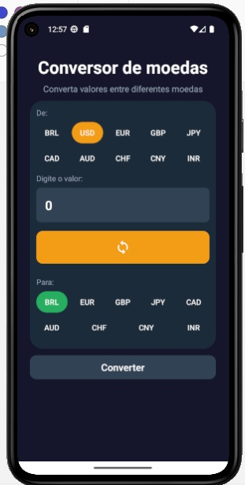
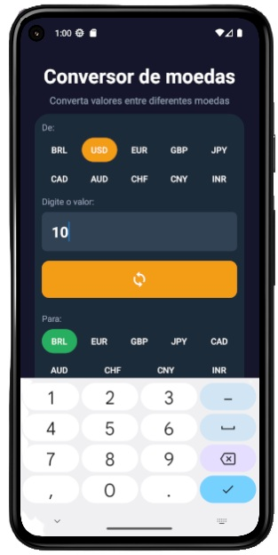
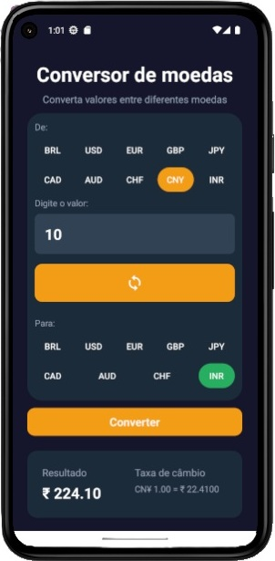
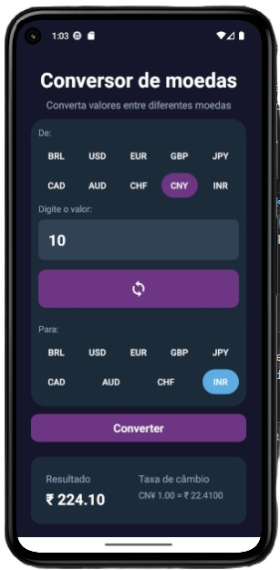
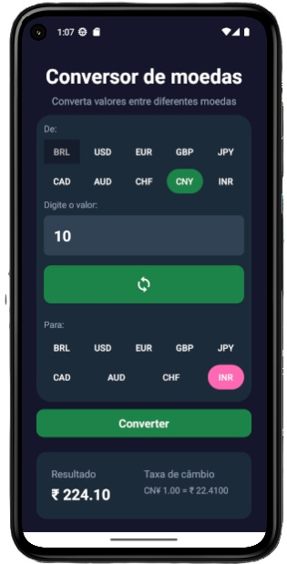

   
 

<h1>Conversores</h1>
<h2>Fase Inicial</h2>
<h2> 💱 Conversor de moeda / Currency Converter App </h2>

Data source: https://api.exchangerate-api.com/ 
  [-9b59b6?style=flat&logo=graduation-cap)](https://www.exchangerate-api.com/)

## -green?style=flat) 
Projeto para fins de aprendizado (passo a passo - criando um ambiente de Produto Mínimo Viável) - app 100% funcional
O principal objetivo é criar um único app para conversores diversos: moeda, temperatura, medidas físicas e químicas.

https://www.notion.so/Desenvolvendo-mobile-React-Expo-2da0cc82a980804a9fe3dd24b9ab1344

Linha do tempo: 
- Em 03/01/2026 - Aplicativo mobile para conversão de moedas em tempo real - idioma do app: português do Brasil (i18n em desenvolvimento) - 100% funcional

Inspiração: 

-----------

 

Project for learning purposes (step by step - creating a MVP environment)
The main goal is to create a single app for various converters: currency, temperature, physical and chemical measurements 

Timeline:
- January 3, 2026 - Mobile application for real-time currency conversion  - app language: Brazilian Portuguese (i18n under development) - app 100% functional

## 🙏 Agradecimentos / Acknowledgements:

Agradecimentos especiais a / Special thanks to:  **[Rodolfo Mori](https://rodolfomori.com.br/)**    
Pelo conteúdo educacional e inspiração no desenvolvimento deste projeto. / For the educational content and inspiration behind this project.

# Currency Converter App

<table align="center" border="0" cellpadding="0" cellspacing="0">
  <tr>
    <td align="center">
      
       
      <strong>Tela Inicial</strong>
    </td>
    <td align="center">
      
       
      <strong>Digitando valores</strong>
    </td>
    <td align="center">
      
       
      <strong>Conversor de moeda em ação</strong>
    </td>
    <td align="center">
      
       
      <strong>Paleta de cores roxo e azul</strong>
    </td>    
    <td align="center">
      
       
      <strong>Paleta de cores verde e rosa</strong>
    </td>        
  </tr>

